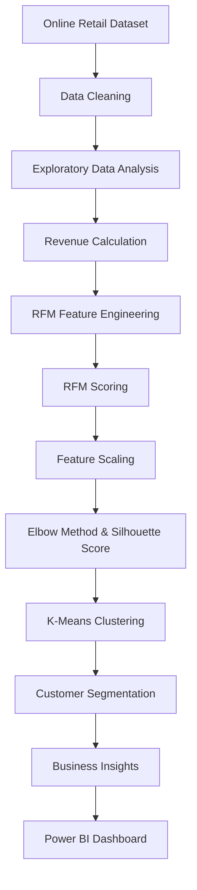

# 🛒 E-Commerce Customer Intelligence System

### Customer Segmentation Using RFM Analysis & K-Means Clustering

<p align="center">
  
  
  
  
</p>

<p align="center">
  <b>Turning E-Commerce Transactions into Actionable Customer Insights</b>
</p>

---

## 📌 Overview

The **E-Commerce Customer Intelligence System** is an end-to-end Data Science and Machine Learning project designed to analyze customer purchasing behavior and identify meaningful customer segments.

Using **Recency, Frequency, and Monetary (RFM) Analysis** combined with **K-Means Clustering**, the project groups customers according to their purchasing patterns, engagement, and spending behavior.

The insights can help businesses understand customer value, identify inactive customers, and design data-driven marketing strategies.

## 🎯 Project Objectives

- Analyze historical e-commerce transaction data.
- Perform data cleaning and preprocessing.
- Conduct Exploratory Data Analysis (EDA).
- Calculate customer revenue and purchasing metrics.
- Perform RFM analysis and customer scoring.
- Apply feature scaling for clustering.
- Determine optimal cluster count using the Elbow Method and Silhouette Score.
- Segment customers using K-Means.
- Generate actionable business insights.

---

## 📊 Project Highlights

| Metric | Result |
|---|---:|
| Dataset | UCI Online Retail |
| Unique Customers | 4,338 |
| Total Revenue | 8,887,208.89 |
| Average Customer Spend | 2,048.69 |
| Selected Clusters | 4 |
| Selected Model | K-Means |

*Revenue and spending values are expressed in the dataset's original currency.*

---

## 🧠 Machine Learning Approach

### RFM Analysis

RFM is a customer analytics technique that evaluates purchasing behavior through three dimensions.

| Feature | Meaning | Business Interpretation |
|---|---|---|
| **Recency (R)** | Time since last purchase | Customer engagement |
| **Frequency (F)** | Number of purchases | Customer loyalty |
| **Monetary (M)** | Total customer spending | Customer value |

### Customer Segmentation

K-Means clustering is used to group customers with similar RFM characteristics.

The number of clusters was evaluated using the Elbow Method and Silhouette Score.

### Model Evaluation

| Clusters (K) | Silhouette Score |
|---|---:|
| 3 | 0.5942 |
| 4 | 0.6162 |
| 5 | 0.6165 |

Four clusters were selected to maintain a balance between clustering quality and model simplicity.

---

## ⚙️ Project Workflow



---

## 🛠️ Tech Stack

| Category | Tools |
|---|---|
| Programming | Python |
| Data Manipulation | Pandas, NumPy |
| Visualization | Matplotlib, Seaborn |
| Machine Learning | Scikit-learn |
| Development | Jupyter Notebook, VS Code |
| Business Intelligence | Power BI |
| Version Control | Git & GitHub |

---

## 📁 Repository Structure

```text
ecommerce-customer-intelligence/
│
├── data/
│   ├── customer_segmentation.csv
│   └── Online Retail.xlsx
│
├── notebooks/
│   └── 01_customer_analysis.ipynb
│
├── powerbi/
│
├── src/
│
├── visualizations/
│
├── .gitignore
├── requirements.txt
└── README.md
```

---

## 🚀 Getting Started

### 1. Clone the Repository

```bash
git clone YOUR_GITHUB_REPOSITORY_URL
cd ecommerce-customer-intelligence
```

### 2. Create a Virtual Environment

```bash
python -m venv .venv
```

### 3. Activate the Environment

**Windows PowerShell**

```powershell
.venv\Scripts\Activate.ps1
```

### 4. Install Dependencies

```bash
pip install -r requirements.txt
```

### 5. Launch Jupyter Notebook

```bash
jupyter notebook
```

Open:

`notebooks/01_customer_analysis.ipynb`

---

## 📈 Business Applications

The customer segments can support business decisions such as:

- **Customer Retention:** Identify customers who have not purchased recently.
- **Loyalty Programs:** Understand customers with frequent purchases.
- **Targeted Marketing:** Develop campaigns based on purchasing behavior.
- **Revenue Optimization:** Identify high-value customer groups.
- **Customer Engagement:** Support personalized customer experiences.

---

## 🔮 Future Enhancements

- [ ] Interactive Power BI dashboard
- [ ] Customer churn prediction
- [ ] Customer Lifetime Value (CLV) estimation
- [ ] Automated customer segmentation
- [ ] Marketing recommendation engine
- [ ] Deployment as an interactive web application

---

## 👨‍💻 Author

<p align="center">
  <b>Tushar Kumar</b><br/>
  B.Tech Computer Science Engineering<br/>
  Data Science | Machine Learning | Software Development
</p>

<p align="center">
  <i>Learning by building real-world projects.</i>
</p>

---

<p align="center">
  ⭐ If you find this project interesting, consider giving the repository a star!
</p>
