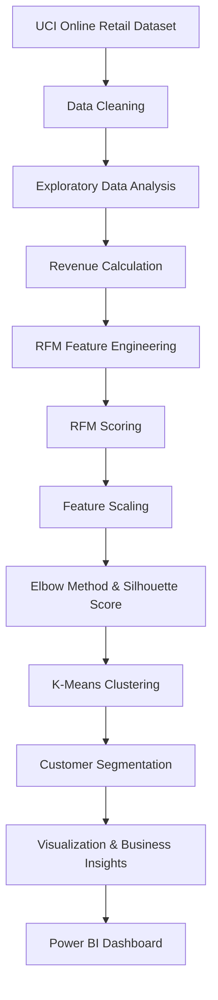
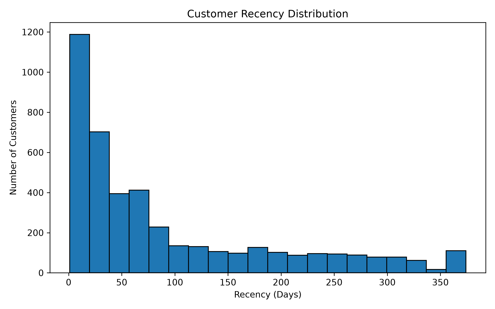
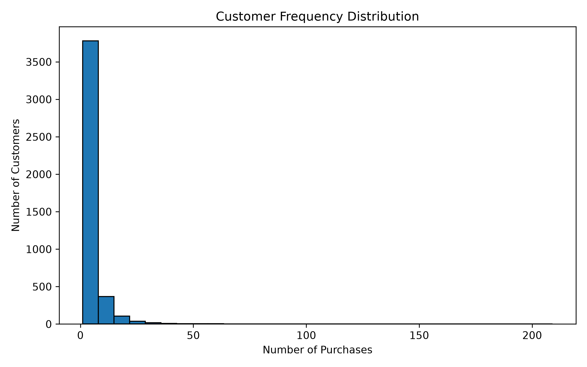
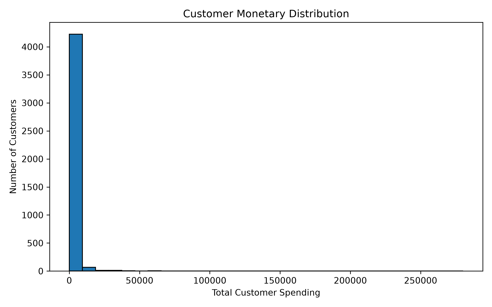
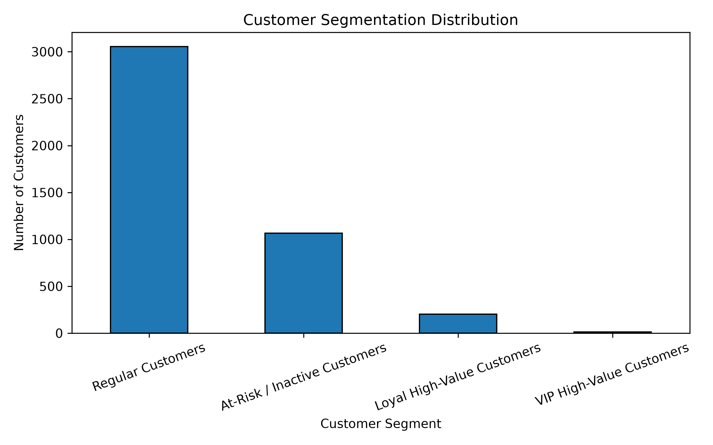
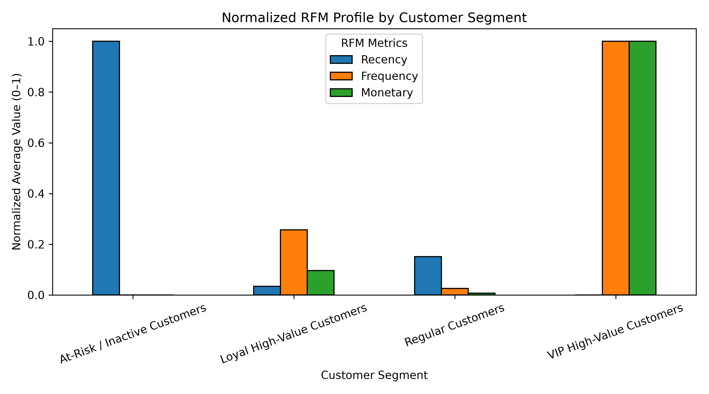
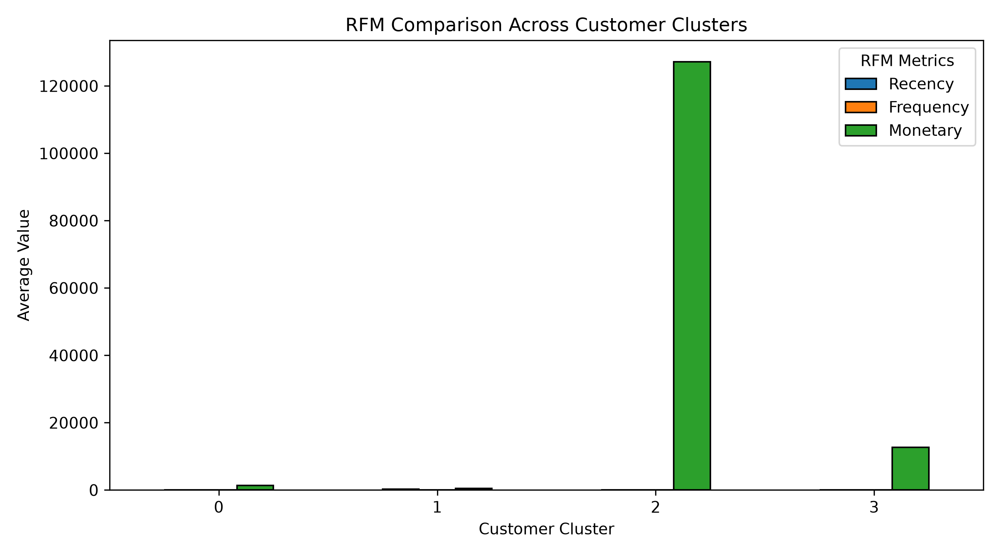
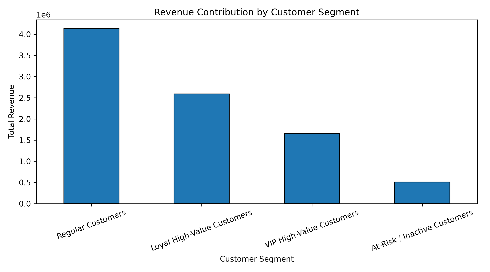
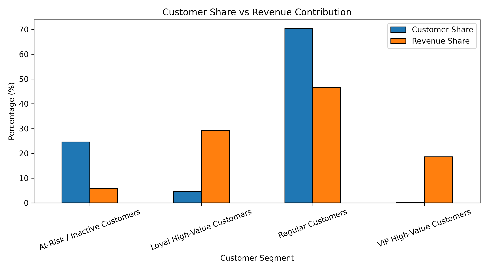
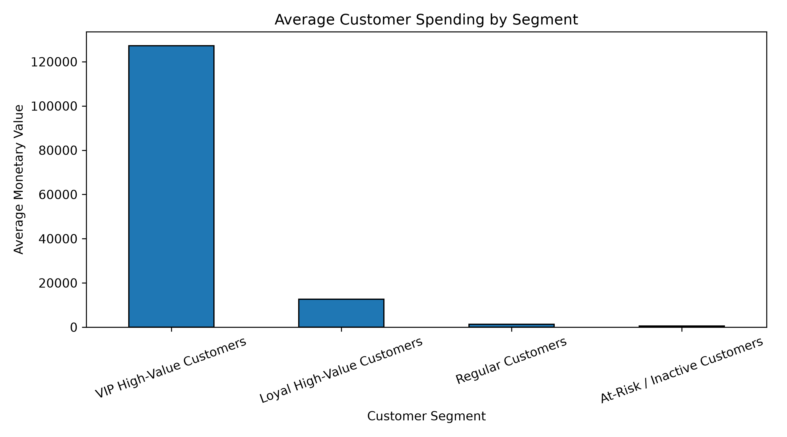

# 🛒 E-Commerce Customer Intelligence System

### Customer Segmentation Using RFM Analysis & K-Means Clustering

<p align="center">
  
  
  
  
  
</p>

<p align="center">
  <b>Turning E-Commerce Transactions into Actionable Customer Insights</b>
</p>

<p align="center">
  An end-to-end data science project that transforms transactional data into customer segments using RFM analysis, K-Means clustering, and business-focused visualizations.
</p>

---

## 📌 Project Overview

The **E-Commerce Customer Intelligence System** is a data analytics and machine learning project developed to understand customer purchasing behavior and identify meaningful customer segments.

The project combines **Recency, Frequency, and Monetary (RFM) Analysis** with **K-Means Clustering** to group customers based on their purchase activity and spending patterns.

By transforming raw transaction records into customer-level insights, the system helps identify customer engagement patterns, understand revenue contribution, and support data-driven marketing and retention strategies.

The project follows a practical data science workflow, from data preprocessing and exploratory analysis to feature engineering, clustering, visualization, and business interpretation.

## 🎯 Project Objectives

- Analyze historical e-commerce transaction data.
- Clean and preprocess transactional records.
- Perform Exploratory Data Analysis (EDA).
- Calculate customer-level purchasing metrics.
- Engineer Recency, Frequency, and Monetary features.
- Apply RFM scoring to understand customer behavior.
- Scale features before clustering.
- Evaluate cluster counts using the Elbow Method and Silhouette Score.
- Apply K-Means clustering for customer segmentation.
- Visualize customer groups and their revenue contribution.
- Translate analytical results into business insights.

## 📊 Project Highlights

| Metric | Result |
|---|---:|
| Dataset | UCI Online Retail |
| Unique Customers | 4,338 |
| Total Revenue | 8,887,208.89 |
| Average Customer Spend | 2,048.69 |
| Selected Clusters | 4 |
| Clustering Algorithm | K-Means |
| Segmentation Method | RFM Analysis |

*Revenue and spending values are expressed in the dataset's original currency.*

## 🧠 Methodology

### 1. Recency, Frequency & Monetary Analysis

RFM analysis is used to represent customer purchasing behavior through three dimensions.

| Feature | Definition | Business Interpretation |
|---|---|---|
| Recency (R) | Time since the customer's last purchase | Customer engagement |
| Frequency (F) | Number of purchases made | Purchase activity |
| Monetary (M) | Total customer spending | Customer value |

These features provide a customer-level representation of transactional behavior.

### 2. Data Preprocessing

The data science workflow includes:

- Transaction data inspection
- Data cleaning and preprocessing
- Customer-level aggregation
- Revenue calculation
- RFM feature engineering
- Feature scaling

### 3. K-Means Clustering

K-Means is applied to group customers with similar RFM characteristics.

The number of clusters is evaluated using:

- Elbow Method
- Silhouette Score

### 4. Model Evaluation

The following Silhouette Scores were obtained during cluster evaluation:

| Number of Clusters (K) | Silhouette Score |
|---|---:|
| 3 | 0.5942 |
| 4 | 0.6162 |
| 5 | 0.6165 |

Four clusters were selected, considering the clustering score and model simplicity. The score for five clusters is slightly higher, so the selection is a practical modeling choice rather than a claim that four clusters produce the absolute maximum score.

---

## ⚙️ Project Workflow



---

## 📈 Visual Results & Analysis

The following charts were generated using Python to explore customer behavior, clustering results, and business metrics.

### RFM Analysis

<p align="center">
  
  
</p>

<p align="center">
  
</p>

### Customer Segmentation

<p align="center">
  
</p>

<p align="center">
  
</p>

<p align="center">
  
</p>

### Business Insights

<p align="center">
  
</p>

<p align="center">
  
</p>

<p align="center">
  
</p>

---

## 💡 Business Applications

The customer segmentation results can support several business activities:

| Business Area | Potential Application |
|---|---|
| Customer Retention | Identify customers with long periods since their last purchase |
| Loyalty Programs | Understand customers with frequent purchasing activity |
| Targeted Marketing | Design campaigns based on customer purchasing patterns |
| Revenue Analysis | Examine the contribution of different customer groups |
| Customer Engagement | Support personalized customer communication |
| Business Planning | Use customer-level metrics to inform marketing decisions |

## 🛠️ Tech Stack

| Category | Technologies |
|---|---|
| Programming Language | Python |
| Data Manipulation | Pandas, NumPy |
| Data Visualization | Matplotlib, Seaborn |
| Machine Learning | Scikit-learn |
| Development Environment | Jupyter Notebook, VS Code |
| Business Intelligence | Power BI |
| Version Control | Git, GitHub |

## 📁 Repository Structure

```text
ecommerce-customer-intelligence/
│
├── data/
│   └── customer_segmentation.csv
│
├── notebooks/
│   └── 01_customer_analysis.ipynb
│
├── powerbi/
│
├── src/
│   ├── plot_average_spending.py
│   ├── plot_cluster_comparison.py
│   ├── plot_customer_revenue_share.py
│   ├── plot_frequency.py
│   ├── plot_monetary.py
│   ├── plot_recency.py
│   ├── plot_segment_profile.py
│   ├── plot_segment_revenue.py
│   └── plot_segments.py
│
├── visualizations/
│   ├── 02_rfm_analysis/
│   ├── 03_clustering/
│   └── 04_business_insights/
│
├── .gitignore
├── requirements.txt
└── README.md
```

## 🚀 Getting Started

### Prerequisites

- Python 3.10 or later
- Git
- Jupyter Notebook

### 1. Clone the Repository

```bash
git clone https://github.com/Bilvish/ecommerce-customer-intelligence.git
cd ecommerce-customer-intelligence
```

### 2. Create a Virtual Environment

```bash
python -m venv .venv
```

### 3. Activate the Environment

**Windows PowerShell**

```powershell
.\.venv\Scripts\Activate.ps1
```

### 4. Install Dependencies

```bash
pip install -r requirements.txt
```

### 5. Launch Jupyter Notebook

```bash
jupyter notebook
```

Open:

```text
notebooks/01_customer_analysis.ipynb
```

### Dataset

The project uses the UCI Online Retail dataset.

The original Excel file is not currently included in the GitHub repository. The processed customer segmentation dataset is available under `data/`.

---

## 🔮 Future Enhancements

- [ ] Complete interactive Power BI dashboard
- [ ] Customer churn prediction
- [ ] Customer Lifetime Value (CLV) estimation
- [ ] Automated customer segmentation pipeline
- [ ] Personalized marketing recommendation engine
- [ ] Interactive web-based analytics application

## 👨‍💻 Author

<p align="center">
  <b>Lavish Chauhan</b><br/>
  B.Tech — Artificial Intelligence & Data Science
</p>

<p align="center">
  <i>Learning by building real-world projects.</i>
</p>

<p align="center">
  <a href="https://github.com/Bilvish">GitHub Profile</a>
</p>

---

<p align="center">
  ⭐ If you find this project interesting, consider giving the repository a star!
</p>

<p align="center">
  <i>Built with Python, machine learning, and curiosity.</i>
</p>
 